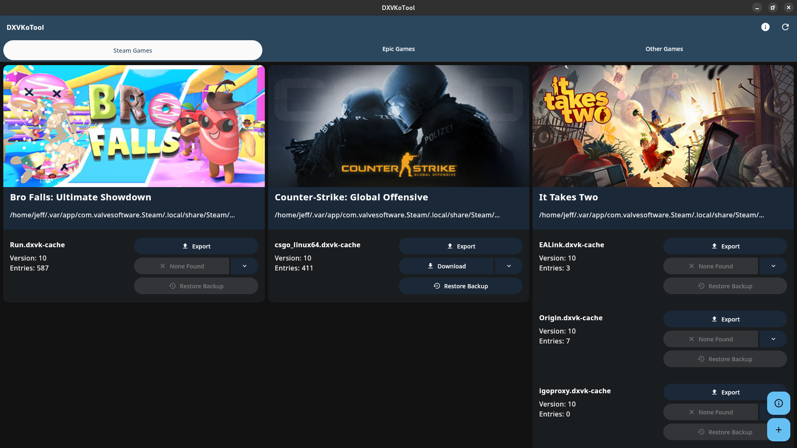
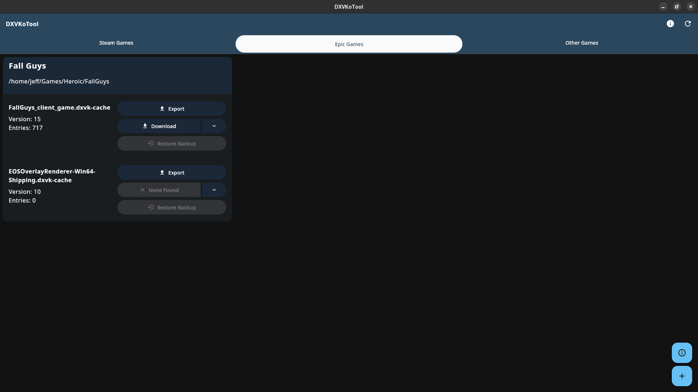
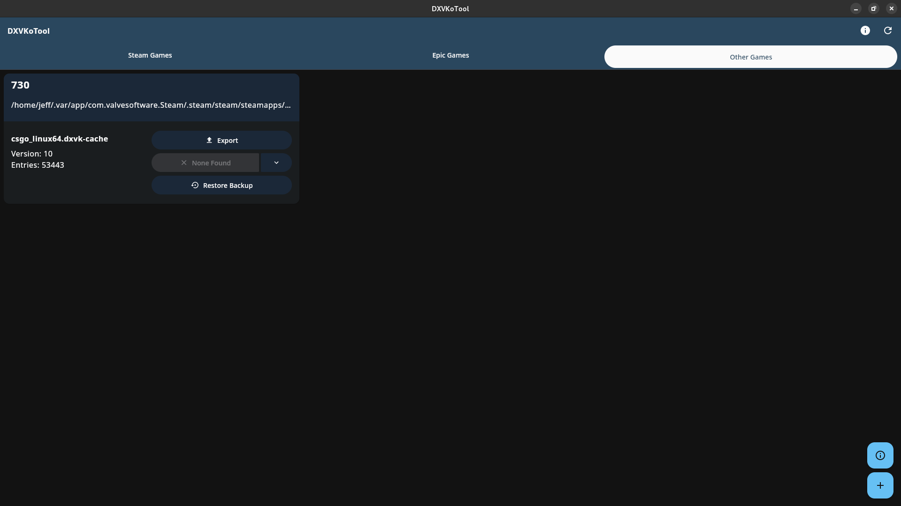
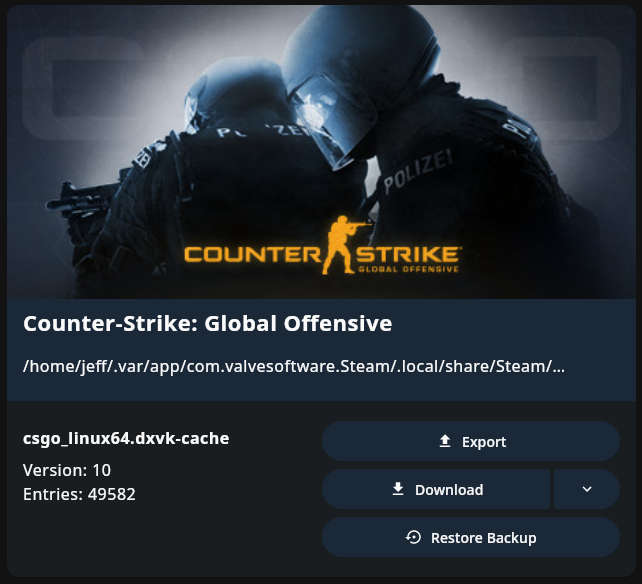
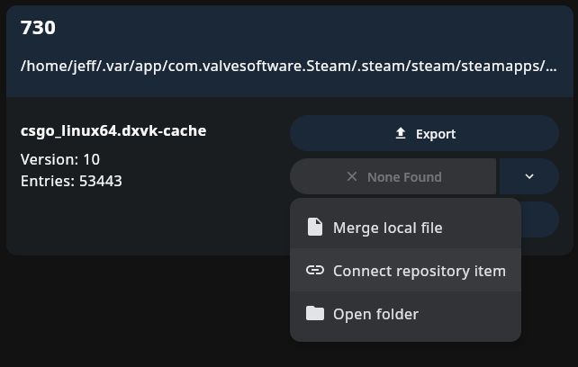
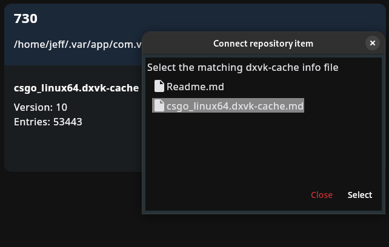
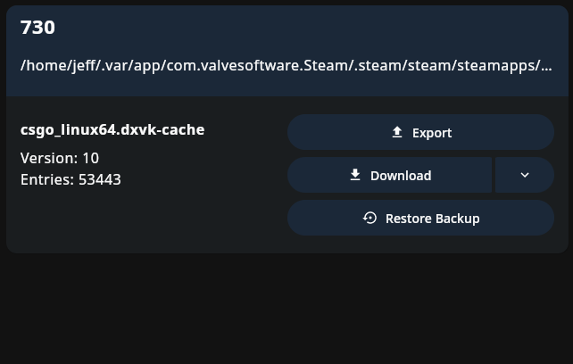
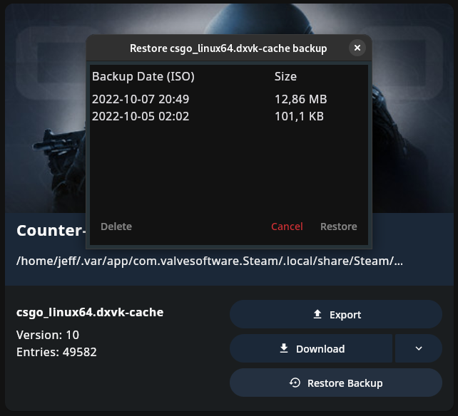

# Usage Guide

### Table of contents

- [Overall Usage](#overall-usage)
  - [Steam Games](#steam-games)
  - [Epic Games](#epic-games)
  - [Other Games](#other-games)
    - [Adding Game](#adding-a-game)
- [Update Game Cache](#update-game-cache)
  - [Not Merge-able](#not-merge-able)
  - [Merge-able](#merge-able)
- [Connect online cache file](#connect-online-cache-file)
- [Restore previous cache](#restore-previous-cache)

## Overall Usage

The main page is divided into 3 parts.

- Steam Games
- Epic Games
- Other Games

| Steam Games                | Epic Games                | Other Games                |
|----------------------------|---------------------------|----------------------------|
|  |  |  |
| ✅ auto-detect              | ⚠️ semi-auto-detect       | ❌ no auto-detect           |

### Steam Games

Steam games will be detected automatically.

- Default Steam installation paths
- Custom Steam libraries

### Epic Games

Epic Games (games) will be detected semi-automatically.

- System installed legendary
- Heroic (Flatpak) provided legendary

### Other Games

All other games have to be added and probably connected to a repository item manually.

#### Adding a game

Click the ```+``` button on the bottom right and select the game root folder, it will find all cache files automatically.

**Epic Games:** if you want to add games from an Epic Games installation, make sure to select the specific game folder, **NOT** the root Epic Games directory!

## Update Game Cache

If a corresponding cache file has been found (or connected manually) you will be able to download it.
Alternatively you can merge it with another local file on your computer.

### Not Merge-able

It may occur that your game cache cannot be merged with the downloaded or local one.

This may have various reasons:

- Cache version mismatch (caches have to be the same version)
- Already up-to-date (no new entries)

### Merge-able

If the new cache file is compatible with yours, it can be merged by clicking the merge button.


After clicking the merge button, the entries value will be updated.



## Connect online cache file

If no cache file has been found automatically (or it is the wrong one) you can connect a cache file yourself.



Select the item you want to connect.



And it will be downloadable.



## Restore previous cache

**Your game doesn't start anymore, crashes, or you have more stutters than before?**

You can restore any previous cache you've updated.

For the screenshots in here I created a backup file (done automatically on update).
I wanted to restore my previous cache file as it has more entries.



